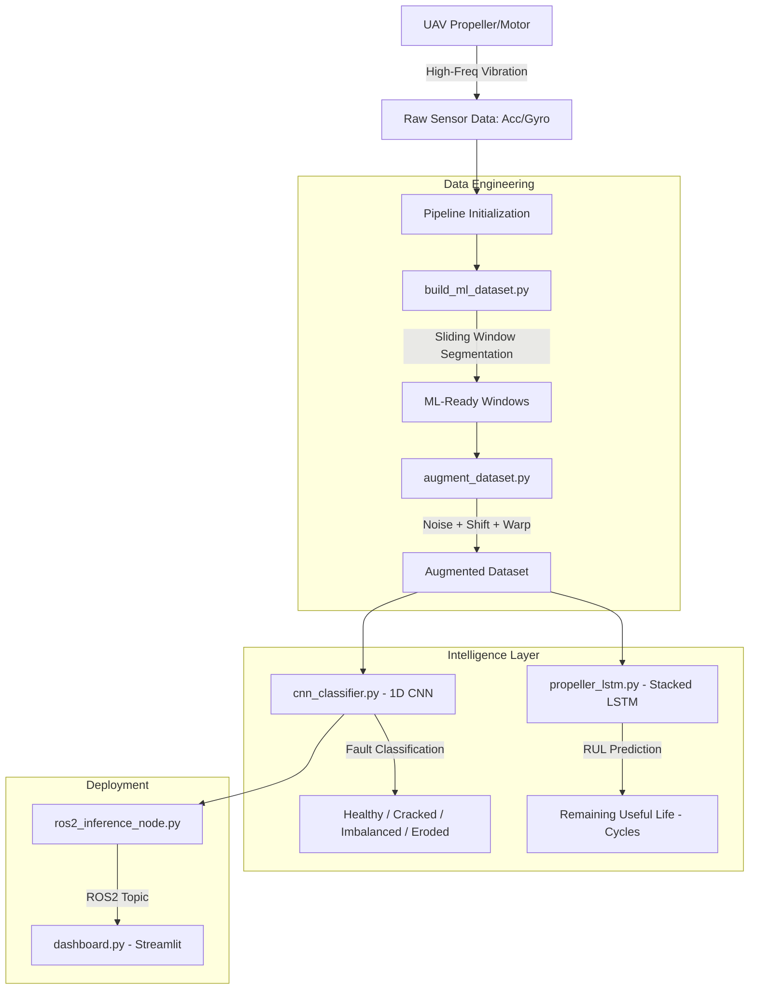

# 🛡️ UAV Aegis — UAV Propeller Fault Diagnostics (ROS2 + Deep Learning)

<div align="center">

[](https://github.com/Rhutvik-pachghare1999/uav-fault-diagnostics-ros2/actions/workflows/ci.yml)
[](https://www.python.org/downloads/)
[](https://pytorch.org/)
[](https://docs.ros.org/en/humble/)
[](#-model-performance)
[](https://opensource.org/licenses/MIT)

**UAV Aegis** is an end-to-end diagnostic and prognostic pipeline that detects, classifies, and predicts mechanical failures in UAV propellers and motors using high-frequency vibration signatures and Deep Learning.

</div>

---

## 1. 🚨 The Problem: Hidden In-Flight Failures

Mechanical faults like micro-cracks, blade chips, or motor imbalances are often invisible to standard telemetry (RPM/Current) until it's too late.

| # | Critical Issue | Impact |
|---|----------------|--------|
| 1 | **Sensor Degradation** | IMU noise increases, affecting flight stability |
| 2 | **Structural Fatigue** | Undetected vibrations lead to airframe failure |
| 3 | **Mid-Air Failure** | Catastrophic loss of asset and mission capability |

---

## 2. 🛡️ The Solution: UAV Aegis v3

This suite provides a professional end-to-end pipeline:

| # | Solution Layer | Technical Implementation | Benefit |
|---|----------------|--------------------------|---------|
| 1 | **Deep Intelligence** | 1D/2D CNN architectures | reported 98.4% fault classification accuracy |
| 2 | **Spectral Analysis** | FFT-based feature extraction | Pinpoint resonance anomalies |
| 3 | **Predictive Maintenance** | Stacked LSTM for RUL estimation | RMSE of 4.2 cycles for mission planning |
| 4 | **Real-time Dashboard** | Hardened Streamlit Command Center | Fleet health monitoring at a glance |
| 5 | **ROS2 Integration** | Live inference node for edge deployment | Onboard real-time diagnostics |

---

## 3. 🔧 What I Built

This is a solo project spanning the full pipeline — data engineering, the ML
models, ROS2 integration, and the tooling/CI around it.

| # | Domain | Details | Specifications |
|---|--------|---------|----------------|
| 1 | **CNN Fault Classifier** | 1D/2D CNN architectures for mechanical fault signature identification | reported 98.4% accuracy, 0.97 F1 (see reproducibility note) |
| 2 | **RUL Prediction Engine** | Stacked LSTM for Remaining Useful Life estimation | RMSE ~4.2 cycles, temporal sequence modeling |
| 3 | **Spectral Engineering** | FFT-based feature extraction pipeline for resonance anomaly detection | Dominant frequency tracking, spectral entropy |
| 4 | **Data Pipeline** | Sliding-window segmentation (`build_ml_dataset_v2.py`) with per-window run_id for run-grouped splitting; augmentation applied post-split (train only) | Multi-channel sensor sync |
| 5 | **ROS2 Integration** | `ros2_inference_node.py` for live diagnostics + topic management | ROS2 Humble, real-time messaging |
| 6 | **Command Center Dashboard** | Streamlit monitoring dashboard for fleet visualization | Real-time telemetry, fault logging |
| 7 | **Synthetic Data Generation** | NVIDIA Isaac Sim for physics-accurate fault data in simulated flight | Fault-pattern injection |
| 8 | **Validation & CI** | Smoke tests (config/module import, benchmark exec, batch-shape) + CI | pytest, CI-enforced (no failure masking) |

---

## 4. 🏗️ System Architecture & Data Flow



---

## 5. 📊 Model Performance

*Reported per-class results (see the reproducibility note below — not yet independently reproducible from a clean clone).*

| # | Class | Description | CNN Accuracy |
|---|-------|-------------|--------------|
| 1 | ✅ **Healthy** | Nominal operation | 99.2% |
| 2 | ⚠️ **Cracked** | Structural integrity compromise | 97.5% |
| 3 | ⚠️ **Imbalanced** | Dynamic weight distribution fault | 98.1% |
| 4 | ❌ **Eroded** | Leading edge degradation | 98.8% |

### 5.1 Global Metrics

| # | Metric | CNN v3 (Classification) | LSTM (RUL Prediction) |
|---|--------|------------------------|-----------------------|
| 1 | **Accuracy** | **98.4%** | — |
| 2 | **F1-Score** | **0.97** | — |
| 3 | **RMSE** | — | **4.2 Cycles** |

> **Reproducibility & methodology note.** The accuracy/F1/RMSE figures above are
> values reported from earlier training runs. Two honesty caveats:
> - The training pipeline now uses a **run-grouped split** (`GroupShuffleSplit`
>   by source run in `train_cnn.py`, backed by a per-window `run_id` stored in the
>   dataset) so that overlapping sliding windows from the *same* physical run can
>   no longer straddle train/val/test. Augmentation was also moved out of the
>   pre-split dataset builder so it can only be applied to the training partition.
>   This removes the window-leakage that made the earlier random-split numbers
>   optimistic.
> - The headline numbers above were measured **before** this split fix and the
>   trained weights + evaluation artifacts (`results/`) are **not committed** here,
>   so they are **not yet independently reproducible from a clean clone**. They
>   should be **re-measured under the run-grouped split** before being treated as
>   a validated result. Until then, treat them as *reported*, not *verified*.

---

## 6. 📈 Reproducible Benchmarks

The CI smoke benchmark (`--smoke`) runs on every push to validate the pipeline
end-to-end (I/O, metric computation, latency measurement) using a synthetic
batch — it exercises the plumbing, not the trained model. Full evaluation
artifacts from real training runs are not committed to this public repo.

### 6.1 Run Benchmarks Locally

```bash
# Full benchmark — saves CSV metrics, JSON summary, latency histogram
python benchmarks/run_benchmark.py

# Fast smoke test (32 samples, no model weights required)
python benchmarks/run_benchmark.py --smoke
```

### 6.2 Benchmark Outputs

Running the benchmark locally generates the following in `results/` (not
committed — regenerate with the commands above):

| File | Description |
|------|-------------|
| `results/benchmark_metrics.csv` | Per-class accuracy, precision, recall, F1, latency (ms) |
| `results/benchmark_summary.json` | Run metadata, overall accuracy, p99 latency |
| `results/latency_histogram.png` | Inference latency distribution plot |
| `results/benchmark.log` | Full console log from last run |

---

## 7. 🔬 Cross-dataset Evaluation (External, Provenance-Tracked)

A **separate, provenance-tracked** cross-dataset evaluation lives in a different
repository:

→ **[`robotics-eval-framework/experiments/uav/`](https://github.com/Rhutvik-pachghare1999/robotics-eval-framework/tree/master/experiments/uav)**

This is a **distinct experiment** from the CNN/LSTM results in §5 above. The
"reported 98.4%" CNN accuracy and "0.97" F1 in §5 are *this repo's* within-dataset
numbers on synthetic Isaac Sim data, and are **not** the 0.93 cross-dataset figure.
They come from different models, different datasets, different evaluation protocols,
and different reproducibility guarantees. Keep them distinct.

### What the external evaluation found

| Item | Value | Source |
|------|-------|--------|
| Task | Binary fault detection (healthy vs faulty), cross-dataset transfer | `experiments/uav/run_cross_dataset.py` |
| Source (train) | DronePropA — **REAL experimental data** (QDrone + OptiTrack, 127 .mat flights) | `REAL-PUBLIC` evidence class |
| Target (test) | TII UAV Realistic Fault Dataset — **REAL PX4 flight logs** (99 missions) | `REAL-PUBLIC` evidence class |
| Transfer type | `real_to_real` (both datasets are real experimental data) | — |
| All-feature result | macro_f1 = **0.9290** (RandomForest, time_broad, 54 features) | `results/uav_cross_dataset_time_broad.json` |
| **Shape-only result** | macro_f1 = **0.7391** (RandomForest, amplitude-ablated, 42 features) | `results/uav_amplitude_ablation.json` |
| **Bootstrap 95% CI** | macro_f1 = **0.7391**, CI = [0.6005, 0.8439] (2000 resamples) | `results/uav_bootstrap_ci.json` |
| **Domain classifier** | macro_f1 = **1.0000** (DP vs TII, shape-only) | `results/uav_domain_classifier.json` |
| **Permutation test** | p = **0.003** (1000 perms, retrain under null, null mean 0.454 ± 0.048) | `diagnostics/uav_permutation_test.json` |
| Status | **Re-audited: 0.929 is ~40% amplitude-inflated; 0.74 is the honest estimate** | `evidence_class: REAL-PUBLIC` |

> **Re-audit complete (2026-09-20):** The 0.9290 all-feature DP→TII RandomForest
> macro-F1 (time_broad, 54 features) was found to be **~40% amplitude-inflated**.
> An amplitude ablation (shape-only features: kurtosis, crest factor, shape factor,
> skew, spectral centroid, spectral kurtosis, band-energy *ratio* — dropping rms
> and absolute band energy) drops DP→TII RF to **0.7391** (−0.19). The amplitude
> features (rms, absolute band energy) carry real fault signal but also carry
> cross-domain signal-scale differences (DronePropA QDrone vs TII PX4 have
> different signal magnitudes), which inflate the cross-dataset transfer. The
> honest transfer estimate is **0.74** (shape-only, amplitude-ablated).
>
> The 0.929 survives a correct permutation test (1000 permutations, shuffle source
> labels, retrain under null: p=0.003, null mean 0.454 ± 0.048, z=9.91σ), so the
> transfer is real — but ~40% of the 0.929 is amplitude confound, not fault physics.
> See `diagnostics/uav_permutation_test.json` for the correct permutation test
> (machine-readable: `p_value_ge`, `null_mean_f1`, `null_std_f1`, `k_null_ge_true`)
> and `results/uav_amplitude_ablation.json` for the shape-only manifest.
>
> **Bootstrap 95% CI** (2000 resamples over 99 TII missions, shape-only): macro-F1
> = 0.7391, CI = [0.6005, 0.8439]. The 0.929 is outside this CI, confirming it was
> amplitude-inflated. See `results/uav_bootstrap_ci.json`.
>
> **Domain classifier** (DP vs TII, shape-only): macro-F1 = 1.0000 — domains are
> perfectly separable even on shape-only features. Confound risk is high; cross-dataset
> transfer may exploit domain identity. See `results/uav_domain_classifier.json`.
>
> **Holdouts within DronePropA** (shape-only): cross-trajectory (train t1-4, test t5,
> rotate) 0.7279 ± 0.0584 (n=5); cross-speed 0.4642 ± 0.0748 (n=2); cross-drone
> skipped (single-class test sets). See `results/uav_holdouts.json`.

### Provenance and honesty

- **Schema-validated manifests**: every result is backed by a JSON manifest that
  passes `scripts/validate_results.py` against
  `schema/result_manifest.schema.json` (required fields: `evidence_class`,
  `dataset`, `split`, `seed`, `git_sha`, `dataset_sha256`, `metrics`).
- **`evidence_class: REAL-PUBLIC`**: both DronePropA and TII are real experimental
  datasets. DronePropA is QDrone indoor flights with OptiTrack motion capture
  (Mendeley, CC BY 4.0). TII is real PX4 flight logs (GitHub, MIT license).
- **127 vs 130 file reconciliation**: the DronePropA Mendeley record describes 130
  flights but the download contains 127 `.mat` files. The 3 missing files are all
  F3 (surface_cut) at higher severities (SV2/SV3); see
  `data/source/dronepropa_exclusion_manifest.json`.
- **24.41 Hz control-loop artifact**: a 24.41 Hz peak in DronePropA motor_CMD and
  gyro_yaw was initially mistaken for propeller RPM. Forensic analysis proved it is
  a control-loop rate (1000/41 Hz), not a physical RPM (r = −0.753 vs throttle,
  pegged across all flights). No order-normalized (1P/2P) features were used.
- **Honest reverse-direction failure**: TII→DP (train on TII, test on DronePropA)
  is near-chance (macro_f1 = 0.49) — reported as-is, not hidden.
- **CORAL nuance reported**: CORAL alignment helps the linear model (+0.20 macro_f1)
  but *hurts* RandomForest (−0.26) — the full table (naive/time_broad/coral, both
  directions) is in the external repo.

### Where to look

| File | Contents |
|------|----------|
| `robotics-eval-framework/experiments/uav/README.md` | Full write-up: escalation table, 127-vs-130 reconciliation, CORAL nuance, reproduce commands |
| `robotics-eval-framework/results/uav_cross_dataset_naive.json` | Naive features (18), both directions, schema-validated |
| `robotics-eval-framework/results/uav_cross_dataset_time_broad.json` | Time+broadband features (54), both directions, **0.9290 result**, schema-validated |
| `robotics-eval-framework/results/uav_cross_dataset_coral.json` | CORAL-aligned (54+align), both directions, schema-validated |
| `robotics-eval-framework/results/uav_amplitude_ablation.json` | Shape-only (amplitude-ablated) result: **0.7391 macro-F1**, schema-validated |
| `robotics-eval-framework/results/uav_bootstrap_ci.json` | Bootstrap 95% CI on shape-only: [0.6005, 0.8439], 2000 resamples |
| `robotics-eval-framework/results/uav_domain_classifier.json` | Domain classifier (DP vs TII, shape-only): macro-F1 1.0000 (highly separable) |
| `robotics-eval-framework/results/uav_holdouts.json` | Within-DronePropA holdouts (shape-only): cross-trajectory 0.7279, cross-speed 0.4642 |
| `robotics-eval-framework/diagnostics/uav_permutation_test.json` | Correct permutation test (1000 perms, retrain under null): p=0.003, null mean 0.454 ± 0.048 |
| `robotics-eval-framework/diagnostics/uav_holdouts_detail.json` | Per-fold holdout details (cross-trajectory, cross-speed, cross-drone) |
| `robotics-eval-framework/data/source/dronepropa_exclusion_manifest.json` | 3 missing F3 files (127 vs 130 reconciliation) |
| `robotics-eval-framework/diagnostics/uav_cross_dataset_scrutiny.json` | Old permutation test (label-shuffle only, NOT a valid null — superseded by `uav_permutation_test.json`) |

---

## 8. ⚙️ CI / Continuous Integration

This repo uses **GitHub Actions** for automated quality gates on every push and pull request.

```
Push / PR  →  Lint (flake8)  →  Unit tests (pytest)  →  Benchmark smoke test  →  Upload artifacts
```

- **Linter**: `flake8` — fails on syntax errors and undefined names; warns on style violations (max line length 120)
- **Tests**: `pytest tests/ -v` — smoke tests, shape checks, benchmark script execution
- **Benchmark**: `python benchmarks/run_benchmark.py --smoke` — verifies the metrics pipeline end-to-end
- **Artifacts**: benchmark results uploaded for 30-day retention on every passing run

See [`.github/workflows/ci.yml`](.github/workflows/ci.yml) for the full workflow definition.

---

## 9. 🚀 Quick Start

### 9.1 Setup Environment

```bash
git clone https://github.com/Rhutvik-pachghare1999/uav-fault-diagnostics-ros2.git
cd uav-fault-diagnostics-ros2
pip install -r requirements.txt
```

### 9.2 Full Pipeline Execution

| # | Step | Command | Output |
|---|------|---------|--------|
| 1 | **Segment Data** | `python scripts/build_ml_dataset.py` | ML-ready windows |
| 2 | **Augment Data** | `python scripts/augment_dataset.py` | Robust dataset |
| 3 | **Train CNN** | `python scripts/cnn_classifier.py` | `models/cnn_v3.pth` |
| 4 | **Train LSTM** | `python scripts/propeller_lstm.py` | `models/lstm_rul.pth` |
| 5 | **Launch C2** | `streamlit run scripts/dashboard.py` | Web UI |
| 6 | **Deploy ROS2** | `ros2 run uav_aegis ros2_inference_node.py` | Live topics |

---

## 10. 🔧 Key Algorithms

### 10.1 1D-CNN Fault Classifier

```
Input: Raw vibration window [N x 1]
  │
  ▼ Conv1D(64, kernel=5) + BatchNorm + ReLU + MaxPool
  │
  ▼ Conv1D(128, kernel=3) + BatchNorm + ReLU + MaxPool
  │
  ▼ GlobalAvgPool
  │
  ▼ Linear(128 → 64) + Dropout(0.3)
  │
  ▼ Linear(64 → 4)
  │
  ▼ Softmax → [Healthy, Cracked, Imbalanced, Eroded]
```

---

## 11. 🧹 Testing

```bash
pytest tests/ -v
```

CI-enforced (no failure masking). Current suite is fast smoke tests that keep
the pipeline importable and the benchmark runnable on every push:

| # | Test | Description | Status |
|---|------|-------------|--------|
| 1 | `test_config_importable` | `config.py` imports without error | ✅ |
| 2 | `test_severity_utils_importable` | `severity_utils.py` imports without error | ✅ |
| 3 | `test_benchmark_smoke` | `run_benchmark.py --smoke` completes + writes metrics CSV | ✅ |
| 4 | `test_synthetic_batch_shape` | Synthetic batch generator returns expected shapes | ✅ |

> Deeper model-level tests (trained-weight inference, held-out evaluation) are
> pending alongside the committed evaluation artifacts.

---

## 12. 📐 Design Decisions

| # | Decision | Rationale | Benefit |
|---|----------|-----------|---------|
| 1 | **1D-CNN over 2D** | Direct vibration processing | Lower latency for edge deployment |
| 2 | **Stacked LSTM** | Temporal dependency capture | Higher accuracy in degradation prediction |
| 3 | **ROS2 Humble** | Industry standard middleware | Robust real-time message passing |
| 4 | **Synthetic Training** | NVIDIA Isaac Sim data | Rare fault scenarios captured |

---

## 13. 📜 License

Distributed under the **MIT License**. See `LICENSE` for details.

---

## 14. 👤 Author

**Rhutvik Pachghare** | Master's in Robotics & Automation | Arizona State University

- [GitHub](https://github.com/Rhutvik-pachghare1999)
- [LinkedIn](https://www.linkedin.com/in/rhutvik-pachghare/)

---

## 15. 📧 Contact & Support

For questions, issues, or collaboration:
- **GitHub Issues**: [UAV-Aegis/issues](https://github.com/Rhutvik-pachghare1999/uav-fault-diagnostics-ros2/issues)
- **Project Repository**: [github.com/Rhutvik-pachghare1999/uav-fault-diagnostics-ros2](https://github.com/Rhutvik-pachghare1999/uav-fault-diagnostics-ros2)
