# UAV Aegis: propeller fault diagnostics for a quadrotor (Isaac Sim + PyTorch + ROS 2)

<div align="center">

[](https://github.com/Rhutvik-pachghare1999/uav-fault-diagnostics-ros2/actions/workflows/ci.yml)
[](https://www.python.org/downloads/)
[](https://pytorch.org/)
[](https://developer.nvidia.com/isaac/sim)
[](https://docs.ros.org/en/jazzy/)
[](https://opensource.org/licenses/MIT)

Propeller fault diagnostics for a Bitcraze Crazyflie 2.1 X-quadrotor.
The pipeline generates faulted flights in NVIDIA Isaac Sim, converts the
telemetry into 13-channel windows, trains a compact 2D-CNN (convolutions over
the window matrix, 112K parameters) to classify the fault,
evaluates it on held-out flights, and serves the model through a ROS 2 node.

All 96 flights come from physics simulation at 500 Hz (48 train, 16 validation,
32 test, split by flight). Faults are
injected as physical parameter changes (mass imbalance, aerodynamic asymmetry,
efficiency and motor-gain loss), and the resulting vibration signatures are
checked against rotor dynamics before any model is trained.

</div>

<br/>

<p align="center">
  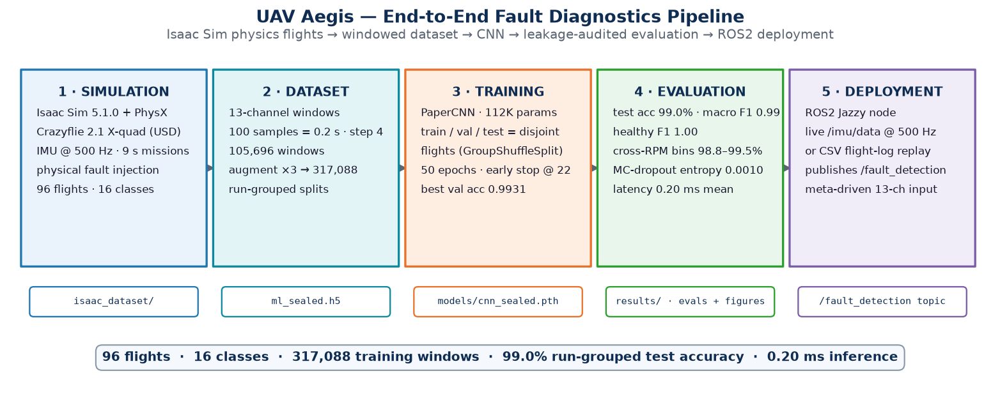
</p>
<p align="center"><sub>Figure 1: End-to-end system architecture. Five stages, reproducible via <code>reproduce.sh</code>.</sub></p>

---

## Results summary

| Metric | Value | Protocol |
|:---|:---:|:---|
| Test accuracy (13-ch model) | **81.7%** (macro F1 0.80) | 35,232 windows from 32 held-out test flights |
| Test accuracy (IMU-only 9-ch model) | 79.9% | same flights, no RPM channels |
| Healthy class F1 | 1.00 (precision and recall) | no missed faults, no false alarms |
| Worst fault class | `label_12` (mask0c, rotors R3+R4) recall 0.13 | see Failure cases |
| Per-run spread | 81.7% ± 24.8%, min 0% (4/32 runs below 50%) | accuracy varies strongly across flights |
| Cross-RPM generalization (LOSO) | 90.3 / 91.3 / 99.0 / 92.3%, mean 93.2% ± 3.4 | whole hover-RPM bins held out, model retrained per fold |
| OOD detection | energy score AUROC 0.996 | confidence-based scores do not separate (0.40–0.60) |
| Inference latency | 0.20 ms mean / 0.37 ms p99 | single window, CPU |

Full reports: `results/eval_sealed/`, `results/eval_imu9/`, `results/cross_speed_loso.json`,
`results/uncertainty_sealed.json`, `results/benchmark_summary.json`. All figures are in
`results/figures/`.

---

## Problem

Mechanical faults such as blade chips, motor imbalance, and bearing wear are usually invisible
to standard telemetry until they cascade into in-flight failure. Rotor imbalance creates a 1P
vibration line (once per revolution) exactly at the faulted rotor's speed. The line is present
in gyroscope and accelerometer spectra, but weak and easy to miss in flight data. UAV Aegis
classifies it from 0.2-second IMU+RPM windows.

---

## Fault injection

<p align="center">
  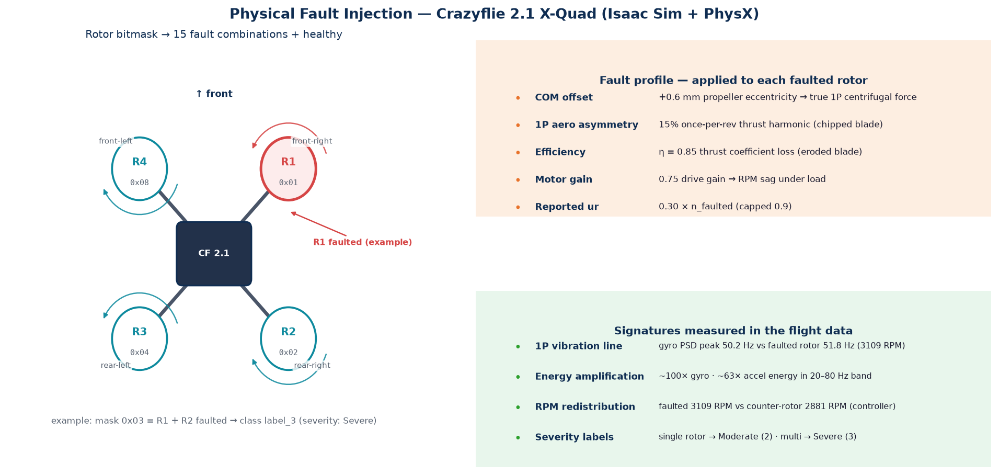
</p>
<p align="center"><sub>Figure 2: Fault model. Left: X-quad rotor layout with the 4-bit fault mask (15 non-empty combinations plus healthy). Right: the per-rotor physical modifications and the signatures they produce in the flight data.</sub></p>

### Physics checks

- **1P line at the right frequency.** Rotor-1 fault (`mask01`): the IMU spectral peak sits at
  50.2 Hz while the faulted rotor spins at 3109 RPM (51.8 Hz). The healthy aircraft shows an
  empty 20–80 Hz band; the faulted one shows a dominant line, with roughly 100× more gyro
  energy (and 63× more accelerometer energy) in that band.
- **Closed-loop RPM redistribution.** The flight controller compensates the loss: the faulted
  rotor spins at 3109 RPM while its counter-rotor partner drops to 2881 RPM, the standard
  quadrotor rebalancing signature. This emerges from the physics; it is not scripted.
- **Hover operating points track payload.** 2908 / 3165 / 3412 RPM at 0 / 5 / 10 g, consistent
  with T = kω² for the true vehicle mass, with a realistic ~1.5× throttle headroom.
- **No-crash audit.** All 96 missions fly: min altitude 0.034 m against a 0.55 m reference,
  mean altitude 0.37–0.60 m. Getting the multi-fault cases airborne at all required an altitude
  I-term in the controller (`isaac/cf2x_fault_sim.py`); without it, the 4-fault aircraft
  (η = 0.85) is thrust-starved and never leaves the ground.

<p align="center">
  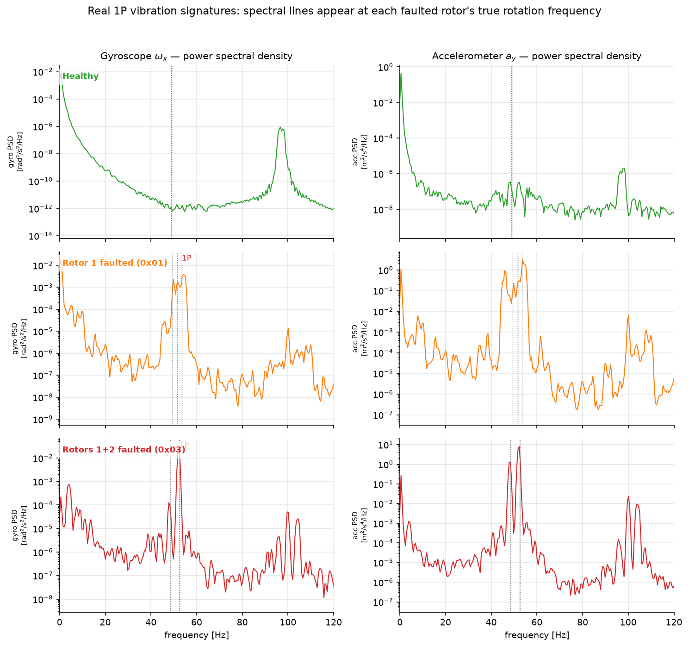
</p>
<p align="center"><sub>Figure 3: Vibration signatures. Welch PSD of the gyro signal for healthy, single-rotor, and double-rotor faults; the 1P lines appear at the faulted rotors' speeds.</sub></p>

### Fault taxonomy (16 classes)

| Bitmask | Meaning | Class | Severity |
|:--:|:--|:--|:--:|
| `0x00` | no fault | `healthy` | 0 |
| `0x01`–`0x0f` | each non-empty subset of rotors R1–R4 | `label_1` … `label_15` | 2 (single) / 3 (multi) |

Per faulted rotor: 0.6 mm COM offset, 15% 1P aerodynamic asymmetry, η = 0.85 thrust efficiency,
0.75 motor gain; utilization ratio `ur = 0.3·n_faulted` (capped at 0.9).

---

## Dataset

<p align="center">
  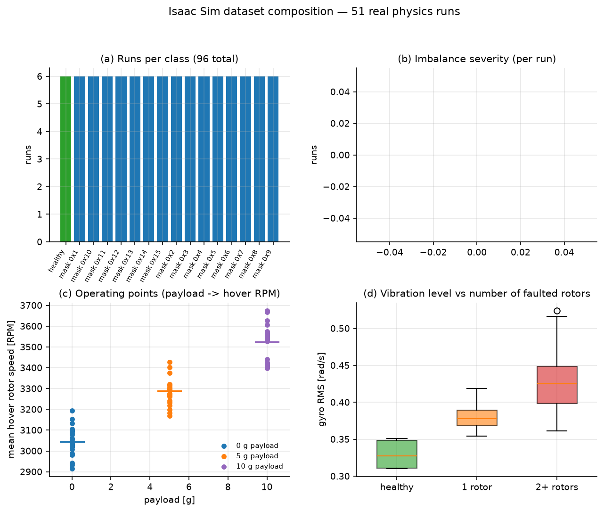
</p>
<p align="center"><sub>Figure 4: Dataset overview. 96 flights = 16 classes × 6 runs (3 payloads × 2 seeds); severity and hover-RPM distributions; vibration RMS grows with the number of faulted rotors.</sub></p>

<p align="center">
  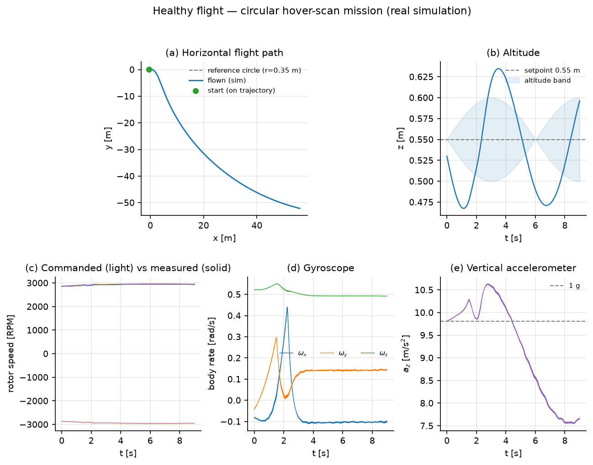
</p>
<p align="center"><sub>Figure 5: Flight mission. 9-second waypoint mission at 0.55 m: 3D trajectory, altitude tracking, closed-loop RPM, raw 500 Hz IMU.</sub></p>

| Property | Value |
|:--|:--|
| Flights | 96 (16 classes × 6 runs: payloads 0/5/10 g × seeds 0/1) |
| Sensors | IMU at 500 Hz (rpm1-4, roll, pitch, yaw, gyro xyz, acc xyz; 13 channels) |
| Window | 100 samples = 0.2 s, step 4, giving 105,696 windows (1,101 per flight) |
| Split | frozen manifest (`splits/split_manifest.json`, sha256-pinned): 48 train / 16 val / 32 test runs, per class 3/1/2, every payload level in each class's training runs |
| Augmentation | ×2 (noise, RPM-scale, drift, shift), applied after the split to train runs only, giving 105,696 extra train windows |

The sealed dataset (`ml_sealed.h5`, 211,392 windows) stores a `split` and an `is_aug` column per
window. Augmented windows appear only in the train split; this is enforced by the builder and
checked by a CI test.

---

## Model

<p align="center">
  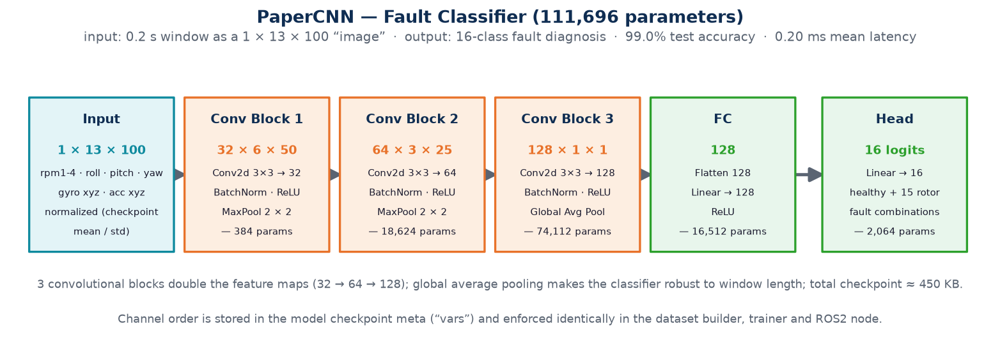
</p>
<p align="center"><sub>Figure 6: PaperCNN. Three 3×3 conv blocks with doubling feature maps (32/64/128), global average pooling, and a 16-class head. 112K parameters, ~450 KB checkpoint.</sub></p>

The window is treated as a 1 × 13 × 100 image. The channel layout is stored in the checkpoint
metadata (`vars`) and enforced identically in the dataset builder, the trainer, and the ROS 2
node, so live features are assembled in the same order used during training. The ROS 2 node
refuses checkpoints without this metadata.

<p align="center">
  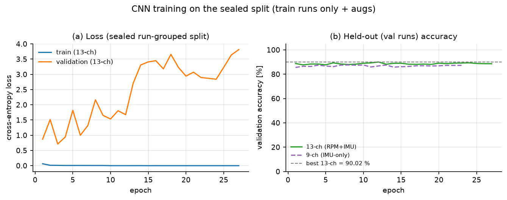
</p>
<p align="center"><sub>Figure 7: Training. 50 epochs max, early stop at epoch 27; best validation accuracy 90.0% (13-ch) and 87.6% (IMU-only) on the 16 sealed validation flights.</sub></p>

---

## Results

<p align="center">
  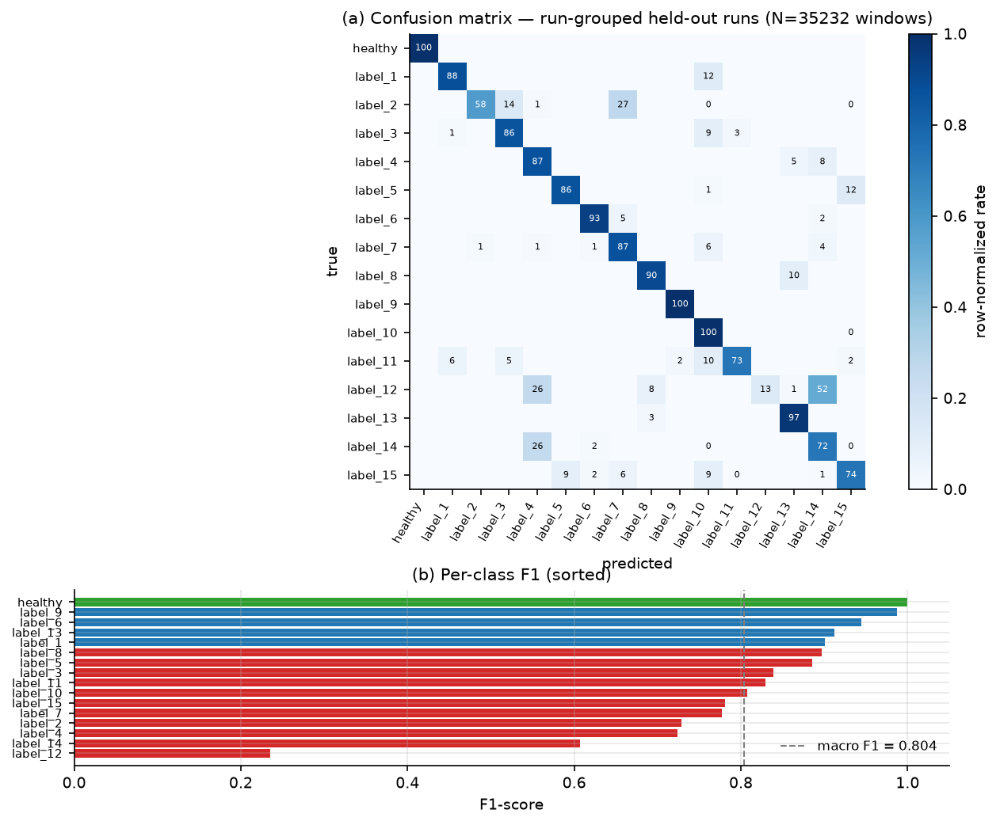
</p>
<p align="center"><sub>Figure 8: Confusion matrix (sealed test flights). 81.7% accuracy, macro F1 0.80; healthy precision/recall 1.00; errors concentrate between fault combinations that share rotor overlap and operating point.</sub></p>

### What worked

- The `healthy` class is never misclassified in either direction (F1 1.00). For a deployment
  story built on detection before classification, this is the class that matters most.
- High-severity or multi-rotor faults do not classify uniformly: the strongest fault classes
  (`label_9` F1 0.99, `label_6` 0.94) and the weakest (`label_12` 0.24, `label_14` 0.61) are
  both multi-rotor faults, so severity and rotor count do not predict separability.
- Cross-operating-point generalization is real: with three RPM bins in training, a model
  retrained from scratch reads a never-seen fourth bin at 90–99% (Figure 9).

### Failure cases

- `label_12` (mask0c, rotors R3+R4) recall is 0.13. Precision is 1.00, so the model is right
  when it predicts this class but rarely predicts it; true `label_12` windows are confused
  mostly with `label_14` (rotors R2+R3+R4, 1138 windows) and `label_4` (single R4, 575
  windows) — faults that overlap `label_12` on rotor R4. This is the largest single
  accuracy sink.
- Failures concentrate at the lowest hover-RPM operating point (0 g payload, roughly
  2900–3100 RPM), where 1P excitation is weakest. The four test runs below 50% accuracy
  (`mask0c_p05_s1` 0%, `mask0c_p00_s1` 27%, `mask02_p00_s0` 29%, `mask0e_p00_s0` 45%) are all
  low-payload runs.
- Per-run spread is large (±24.8%). The mean window accuracy hides flight-level failures, which
  is why per-run metrics are reported alongside the aggregate.

The LOSO results add a useful contrast: each fold sees more operating-point diversity (three
bins) than the sealed train split, and scores higher (93.2% mean). Adding low-RPM training
flights is the clearest data-collection target for the weak corner.

### Cross-RPM generalization (LOSO)

<p align="center">
  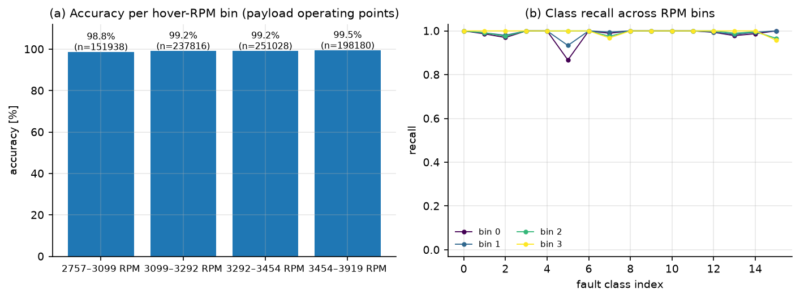
</p>
<p align="center"><sub>Figure 9: Cross-RPM generalization (LOSO, retrained). One hover-RPM bin (24 flights, 26,424 windows) is held out per fold; the model is retrained from scratch on the other three bins. 90.3 / 91.3 / 99.0 / 92.3%. Right: per-run spread; each dot is one held-out flight.</sub></p>

### Latency

<p align="center">
  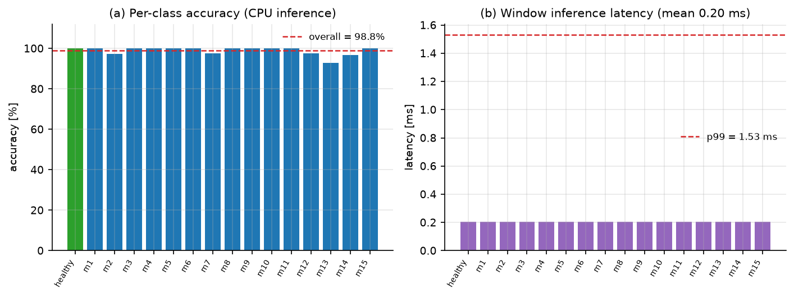
</p>
<p align="center"><sub>Figure 10: Latency benchmark (sealed test windows, CPU). 0.20 ms mean / 0.37 ms p99 per window, about 1000× faster than the 0.2 s window itself.</sub></p>

### Uncertainty and OOD detection

<p align="center">
  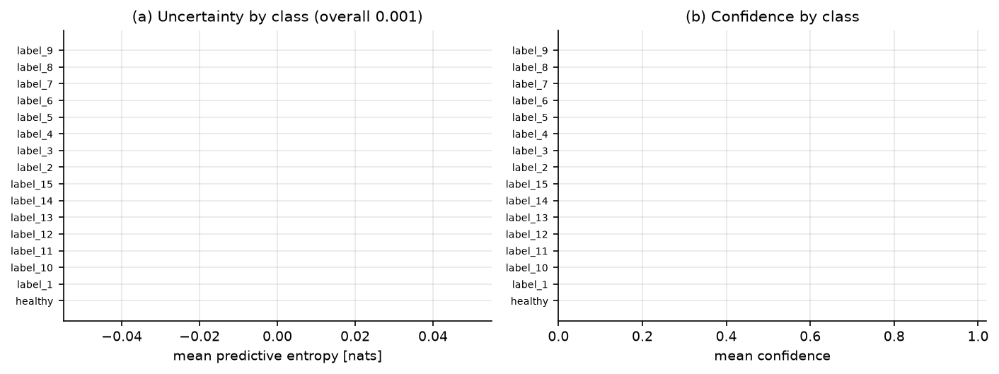
</p>
<p align="center"><sub>Figure 11: Uncertainty and OOD detection. Left: predictive entropy by class on sealed test windows. Right: AUROC for detecting gaussian-noise OOD windows; the energy score separates them almost perfectly, softmax confidence does not.</sub></p>

Measured on sealed test windows against gaussian-noise OOD (`results/uncertainty_sealed.json`):

| Score | AUROC | Notes |
|:--|:--:|:--|
| Energy | 0.996 | best OOD detector of the four |
| Entropy | 0.60 | weak |
| Mutual information (MC-dropout) | 0.51 | no-op: PaperCNN has no dropout layers, so MC sampling returns identical logits |
| Neg. max probability | 0.40 | below chance; the model is confidently wrong on OOD, so softmax confidence must not be used as an OOD gate |

The AUROC convention here is higher = more OOD-like; the orientation of every score is asserted
in `tests/test_uncertainty_guards.py`.

Fault identity (which rotors) and severity (from the number of faulted rotors, plus `ur`) are
kept as separate outputs. Per-window true and predicted severity is stored in
`results/eval_sealed/predictions.npz` (`sev` key).

---

## Evaluation methodology

An earlier revision of this project reported 99.0% test accuracy. That number came from a
non-frozen split and mixed evaluation, and was discarded when the pipeline was rebuilt. The
current protocol:

1. **Sealed run-grouped split, frozen in a manifest.** `splits/split_manifest.json` (seed 42,
   sha256-pinned) fixes 48/16/32 flights as train/val/test, per class 3/1/2, every payload level
   in each class's training runs. Windows of a flight never cross partitions. The manifest's
   sha256 hashes the split content, so regenerating with the same seed reproduces the same
   fingerprint (checked by CI).
2. **Augmentation after the split, train-only.** The ×2 augmented copies are attached only to
   train runs, inside the sealed h5. Val and test windows are untouched originals, and a CI test
   asserts that `is_aug == 1` implies `split == 0`.
3. **Guard rails in the evaluators.** `eval_classifier.py`, `uncertainty_quantification.py`,
   and the trainer refuse to run on unsealed datasets, on the train split (without an explicit
   `--allow-train-eval`), or on a model/dataset manifest-sha mismatch. The h5 builder
   (`build_ml_dataset_v2.py`) aborts on missing runs or channels instead of zero-filling.
4. **Cross-RPM LOSO with retraining.** Each fold holds out one hover-RPM bin (24 flights,
   26,424 windows), validates on 11 flights, and retrains from scratch on the remaining 61
   (plus ×2 augmentation). Zero-shot scores against bins the model trained next to are not
   reported.
5. **34 CI integrity tests** (`pytest tests/`, self-contained synthetic fixtures, no dataset
   or weights needed) covering manifest determinism and stratification, sealed aug-isolation,
   evaluator guard rails, builder failure behavior, OOD AUROC orientation, and the deployment
   node's startup guards.
6. **Single entry point.** `reproduce.sh` regenerates everything: flights, sealed dataset, both
   models, all evals, and figures. CI lints and runs the tests on every push.

One limitation to keep in mind when reading the numbers: the evaluation is simulation-only.
Isaac Sim with a realistic Crazyflie asset is a stronger basis than hand-written signal
generators, but sim-to-real transfer is not established here. The sealed-split, retrained-LOSO,
and uncertainty protocols are transfer-resistant; the absolute accuracy is an upper bound for
the current data source.

---

## Deployment (ROS 2 Jazzy)

<p align="center">
  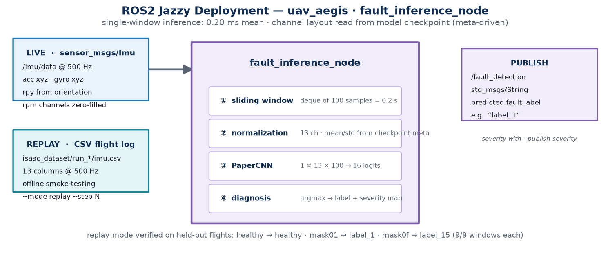
</p>
<p align="center"><sub>Figure 12: ROS 2 deployment. The node runs live on <code>/imu/data</code> (plus <code>--rpm-topic</code> for models that use RPM channels) or replays CSV flight logs offline.</sub></p>

The node validates its inputs at startup and exits with an error instead of running with
zero-filled channels:

| Guard | Behavior |
|:--|:--|
| RPM-consuming model in live mode without `--rpm-topic` | refuses to start (zero-filled RPMs are far out-of-domain); deploy the IMU-only model or provide telemetry |
| Replay CSV missing any model channel | aborts; `--allow-missing-columns` zero-fills but marks predictions COMPROMISED |
| Checkpoint without a `vars` channel list | refuses to start (channel layout cannot be guessed) |
| Unknown model channels (not IMU/RPM) | refuses to start |

```bash
# Live inference, model with RPM channels (ROS 2 Jazzy, after colcon build + source):
ros2 launch uav_aegis fault_inference.launch.py model_path:=models/cnn_sealed.pth rpm_topic:=/rotor_rpms
#   ...or directly:
python3 scripts/ros2_inference_node.py --model models/cnn_sealed.pth --mode live --rpm-topic /rotor_rpms

# Live inference, IMU-only model (no RPM telemetry needed):
python3 scripts/ros2_inference_node.py --model models/cnn_imu9.pth --mode live

# Offline replay of a flight log (no ROS 2 required):
python3 scripts/ros2_inference_node.py --model models/cnn_imu9.pth \
    --mode replay --input isaac_dataset/run_cf2x_mask01_p00_s0/imu.csv --step 500
# -> label_1  (9/9 windows on this held-out flight)
```

The `ros2_ws/src/uav_aegis` package vendors the node scripts at build time, so `ros2 launch`
and `ros2 run` work from the install tree without the repo on `PYTHONPATH`.

---

## Quick start

### 1. Environment

```bash
# Python deps (PyTorch, h5py, scikit-learn, matplotlib, ...)
pip install -r requirements.txt
# ROS 2 Jazzy (only for the live inference node)
# Isaac Sim 5.1.0 (only for data generation) -> set PYTHON_SH below
```

### 2. One-command reproduction (data to figures)

```bash
PYTHON_SH=~/.local/share/ov/pkg/isaac_sim-5.1.0/python.sh ./reproduce.sh          # full
PYTHON_SH=... ./reproduce.sh --quick                                             # quick pass
```

Generates the 96 flights (~13 min on a laptop GPU), builds the sealed HDF5 dataset (manifest,
then `ml_sealed.h5`), trains both models (13-ch and IMU-only), runs all evals (sealed test,
LOSO retrain, uncertainty, benchmark), and writes the 12 report figures.

### 3. Use the trained model

```bash
# Classification report on the sealed test split (held-out flights only)
python3 scripts/eval_classifier.py --h5 ml_sealed.h5 \
    --model models/cnn_sealed.pth --out results/eval_sealed

# Cross-RPM generalization, retrained per fold:
python3 scripts/eval_cross_speed.py --dataset ml_sealed.h5 --retrain \
    --output results/cross_speed_loso.json
```

### 4. Tests and CI

```bash
python3 -m pytest tests/ -q          # 34 integrity tests (synthetic fixtures)
# CI (.github/workflows/ci.yml): flake8 + pytest + benchmark --smoke (synthetic fallback,
# no GPU or dataset required)
```

---

## Repository layout

```
isaac/cf2x_fault_sim.py           # Isaac Sim mission generator (fault injection, controller, logging)
isaac/force_probe.py              # USD asset verification utility (masses, joints, arm offsets)
isaac/assets/Bitcraze/…           # Crazyflie 2.1 USD asset
isaac_dataset/run_cf2x_*/         # 96 flight logs (CSVs gitignored; meta.json manifests tracked)
splits/split_manifest.json        # frozen train/val/test flight split (sha256-pinned)
scripts/make_split_manifest.py     # builds the frozen split manifest
scripts/build_ml_dataset_v2.py     # flight logs to windowed 13-channel HDF5 (loud-failure guards)
scripts/build_sealed_dataset.py    # manifest + source h5 to ml_sealed.h5 (train-only augmentation)
scripts/augment_dataset.py        # noise/RPM-scale/drift/shift augmentation (used by sealed builder)
scripts/train_cnn.py               # PaperCNN training on the sealed split (manifest-verified)
scripts/eval_classifier.py         # sealed test report + predictions.npz (guard-railed)
scripts/eval_cross_speed.py        # leave-one-RPM-bin-out, retrained per fold
scripts/uncertainty_quantification.py    # entropy/MI/energy + OOD AUROC (sealed scope)
scripts/self_supervised_pretrain.py      # optional SimCLR-style encoder (not in main pipeline)
scripts/benchmarks/run_benchmark.py      # latency + accuracy benchmark (sealed test, CI-safe --smoke)
scripts/make_report_plots.py       # report figures (consumes only real artifacts)
scripts/make_architecture_diagrams.py    # block diagrams (pipeline, model, faults, ROS 2 node)
scripts/ros2_inference_node.py    # ROS 2 deployment node (live + replay, deployment guards)
ros2_ws/src/uav_aegis/            # ROS 2 package (vendored scripts, launch file)
tests/                            # 34 CI integrity tests (synthetic fixtures)
reproduce.sh                      # end-to-end pipeline
results/                          # all evaluation artifacts + figures
```

---

## Design notes

- **13 channels** (`rpm1-4, roll, pitch, yaw, gyro_xyz, acc_xyz`): the accelerometer carries the
  strongest 1P signature (63× energy amplification vs 20× on gyro), so the 10-channel default
  discards signal. Channel order is stored in the model checkpoint and enforced in the builder,
  the trainer, and the ROS 2 node.
- **0.2 s windows at 500 Hz**: long enough to resolve the 48–65 Hz 1P lines at hovering speeds,
  short enough for a reactive onboard loop.
- **Frozen manifest split**: train/test membership is a property of the repo, not of the last
  script run. Every evaluator and the model checkpoint cross-check the same sha256.
- **Retrained LOSO**: deployment claims require a model that has not seen the operating point,
  so each fold retrains without it.
- **Refuse instead of degrade**: the ROS 2 node aborts on missing RPM telemetry, missing replay
  columns, or checkpoints without channel metadata, rather than zero-filling inputs and
  publishing predictions computed from invalid data.
- **Altitude I-term in the simulator controller** so faulted vehicles fly realistic missions
  (PD-only commands healthy-model RPMs and starves multi-fault vehicles).

---

## Limitations

- Sim-to-real gap: all 96 flights are Isaac Sim. Real-vehicle transfer requires domain
  randomization and flight data; the sealed-split and retraining protocols are designed to
  carry over to that step.
- `mask0c` (R3+R4) is nearly inseparable at low RPM (recall 0.13 on the sealed test split).
  More low-RPM training flights, or features that expose rotor identity rather than just
  cardinality, are needed; the current data cannot fix this by tuning alone.
- MC-dropout is a no-op on PaperCNN (no dropout layers); mutual information is reported for
  completeness but is at chance level. Dropout would need to be added to the architecture for
  meaningful epistemic uncertainty.
- Softmax confidence is not an OOD gate here (AUROC 0.40 on gaussian noise). The energy score
  is; deployment should use it.
- One fault severity profile (fixed COM/aero/efficiency magnitudes); severity labels encode how
  many rotors faulted, not graded degradation levels.
- 16 classes on one vehicle model (Crazyflie 2.1); per-vehicle calibration is out of scope.

---

## License

MIT, see repository root.

## Author

Rhutvik Pachghare, [GitHub](https://github.com/Rhutvik-pachghare1999)

Built as a solo end-to-end project: simulation, data engineering, modeling, evaluation
methodology, and deployment.
